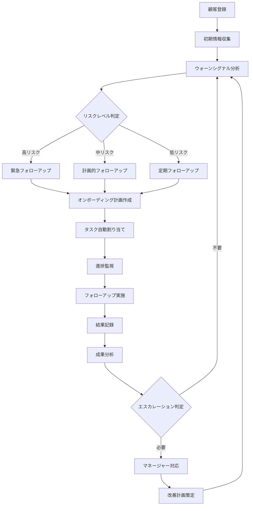
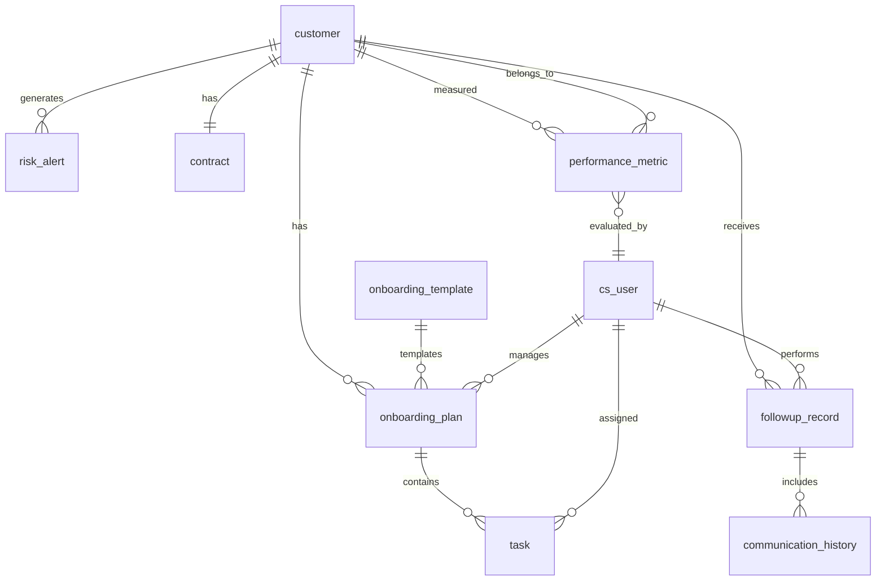
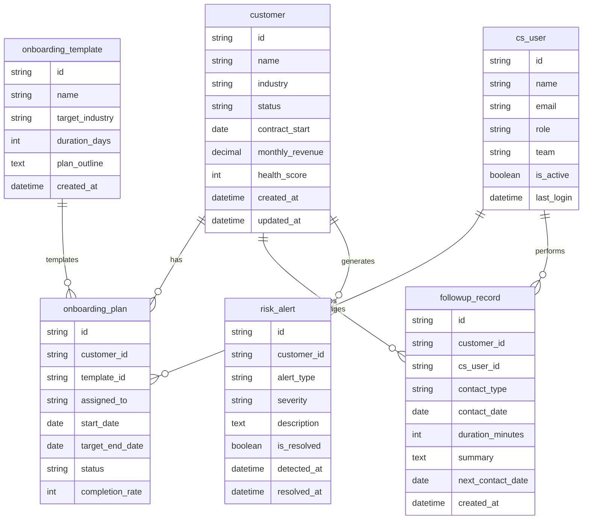

## はじめに

AI Empowersの平下です。BtoBカスタマーサクセスSaaSを例に要件定義の進め方をまとめてみました。
ドメイン駆動設計（DDD）のユビキタス言語から始めて、以下の流れで整理していきます：

- 業務の共通言語を定義
- アクター別のユースケース整理
- 業務フローの可視化
- ユーザーストーリーの作成
- データ構造設計
- API設計

実際にChatGPTとMermaidを組み合わせて進めたやり方と、各段階で使ったプロンプト例も載せておきます。

**この記事で学べること：**  
- ユビキタス言語を活用した要件の整理方法  
- Mermaidを使った業務フローとデータ構造の可視化  
- 実装につながるAPI設計の考え方  

***

## 1. ユビキタス言語の定義

### プロンプト例  
```
カスタマーサクセス業務で使われる共通言語（ユビキタス言語）を定義してください。
以下の観点を含めて整理してください：
- 主要な業務プロセス
- 各プロセスでの役割（誰が何をするか）
- システムが自動化すべき部分
AIにも理解しやすい形式で出力してください。
```

### 結果  

| 業務プロセス | 担当者 | 具体的な作業内容 | システム自動化部分 |
|-------------|--------|----------------|------------------|
| **顧客情報管理** | CS担当 | 基本情報・契約詳細・利用状況の一元管理 | ウォーンシグナル自動抽出（ログイン頻度低下、機能利用率減少の検知） |
| **オンボーディング計画** | CSマネージャー | 顧客別のオンボーディングプラン設計・承認 | プランに基づくタスク自動割り当て・進捗追跡 |
| **定期フォローアップ** | CS担当 | 面談・メール・電話の内容を構造化して記録 | フォローアップ履歴に基づく次回アクション自動通知 |
| **成果測定とエスカレーション** | CSマネージャー | NPS・利用率・契約更新率の分析と改善策立案 | 閾値割れ時のエスカレーションタスク自動生成・上級者通知 |

**重要な用語定義：**
- **ウォーンシグナル**: 解約リスクを示す指標（例：ログイン頻度30%以上低下、主要機能7日以上未使用）
- **オンボーディングプラン**: 新規顧客の成功に向けた3ヶ月間の段階的支援計画
- **ヘルススコア**: 顧客状況を数値化した指標（利用状況・満足度・成果達成度を総合評価）

***

## 2. ユースケースの整理

### プロンプト例  
```
上記ユビキタス言語を元に、カスタマーサクセス業務のユースケースをアクター別に整理してください。
各アクターの「なぜそれを行うのか」という目的も含めて説明してください。
AIにも理解しやすい形式で出力してください。
```

### 結果  

| アクター | 主要ゴール | 目的・背景 | 成功指標 |
|:---------|:-----------|:-----------|:---------|
| **CS担当** | 顧客情報の正確管理と早期課題発見による迅速対応 | 解約防止と長期的な顧客関係構築のため | 担当顧客の満足度平均、課題解決時間 |
| **CSマネージャー** | 効果的なオンボーディング計画立案とチーム成果最大化 | 新規顧客の早期成功と既存顧客の継続利用促進のため | チーム全体の更新率、オンボーディング完了率 |
| **CS担当** | 全コミュニケーション履歴の記録と一貫した顧客対応 | 信頼関係維持と担当者変更時の引継ぎ効率化のため | 記録完了率、顧客からのフィードバックスコア |
| **システム** | 人的作業の自動化と意思決定に必要なデータ提供 | 業務効率化と対応品質向上のため | 自動化タスク実行成功率、アラート精度 |

**アクター間の連携ポイント：**
- CS担当 ↔ システム：日次の顧客状況確認とアラート対応
- CSマネージャー ↔ CS担当：週次の進捗確認とエスカレーション判断
- CS担当 ↔ 顧客：月次の定期フォローアップとプロアクティブサポート

***

## 3. 業務フローの可視化

### プロンプト例  
```
整理したユースケースから、カスタマーサクセス業務の業務フローをMermaid記法で図解してください。
フローには判定ポイントと例外処理も含めてください。
AIにも理解しやすい形式で出力してください。
```

### 結果  


**フロー詳細説明：**

| ステップ | 所要時間 | 責任者 | 成果物 |
|----------|----------|--------|--------|
| 顧客登録 | 1営業日 | CS担当 | 顧客プロファイル |
| 初期情報収集 | 3-5営業日 | CS担当 | 現状分析レポート |
| ウォーンシグナル分析 | 自動（日次） | システム | リスク評価結果 |
| オンボーディング計画作成 | 5-7営業日 | CSマネージャー | 3ヶ月実行計画 |
| フォローアップ実施 | 継続（月1-4回） | CS担当 | 活動記録・課題リスト |

***

## 4. ユーザーストーリーの作成

### プロンプト例  
```
上記で整理したカスタマーサクセス業務のユースケースを、ユーザーストーリー形式で具体的に表現してください。
「〜として、〜したい、なぜなら〜だから」という自然な日本語で記述してください。
各アクターの視点から実際の業務シーンを想定したストーリーを作成してください。
AIにも理解しやすい形式で出力してください。
```

### 結果  

#### CS担当のユーザーストーリー

| ストーリーID | ユーザーストーリー | 受入基準 |
|-------------|------------------|----------|
| **US-001** | CS担当として、担当している全顧客の利用状況を一覧で確認したい。なぜなら問題のある顧客を早期に発見して、解約を防ぎたいから | ・ダッシュボードで全担当顧客の状況が確認できる<br>・ウォーンシグナルがある顧客がハイライト表示される<br>・過去30日の利用トレンドが視覚化される |
| **US-002** | CS担当として、顧客情報を簡単に更新したい。なぜなら面談で得た最新情報を正確に記録して、チームで共有したいから | ・フォーム入力で基本情報を更新できる<br>・変更履歴が自動記録される<br>・必須項目の入力チェックがある |
| **US-003** | CS担当として、アラートが発生した顧客に素早く対応したい。なぜなら早期対応で解約リスクを最小化したいから | ・アラート通知が即座に届く<br>・推奨対応アクションが提示される<br>・対応完了まで追跡できる |

#### CSマネージャーのユーザーストーリー

| ストーリーID | ユーザーストーリー | 受入基準 |
|-------------|------------------|----------|
| **US-004** | CSマネージャーとして、新規顧客のオンボーディングプランを効率的に作成したい。なぜなら標準化された質の高い支援を一貫して提供したいから | ・業界別テンプレートから選択できる<br>・顧客特性に応じてカスタマイズできる<br>・承認ワークフローがある |
| **US-005** | CSマネージャーとして、チーム全体の成果を可視化したい。なぜなら適切なリソース配分と改善策を効果的に決定したいから | ・担当者別の成果指標が確認できる<br>・月次/四半期のトレンド分析ができる<br>・Excel出力が可能 |
| **US-006** | CSマネージャーとして、エスカレーションされた案件を効率的に処理したい。なぜなら重要顧客の満足度を維持して継続利用につなげたいから | ・エスカレーション理由と背景が明確<br>・過去の対応履歴が参照できる<br>・対応結果をチームで共有できる |

#### CS担当のユーザーストーリー（フォローアップ業務）

| ストーリーID | ユーザーストーリー | 受入基準 |
|-------------|------------------|----------|
| **US-007** | CS担当として、顧客との面談内容を構造化して記録したい。なぜなら次回の対応で一貫したサービスを提供して、顧客の信頼を獲得したいから | ・定型フォーマットで記録できる<br>・課題と次回アクションが明確に分けられる<br>・検索・フィルタ機能がある |
| **US-008** | CS担当として、次回のフォローアップ予定を自動で通知してほしい。なぜなら重要な連絡を見逃して、顧客との関係を悪化させたくないから | ・カレンダー連携で予定登録される<br>・事前リマインダーが送信される<br>・緊急度に応じて通知方法が変わる |
| **US-009** | CS担当として、顧客の質問に対する回答を素早く見つけたい。なぜなら正確で迅速な対応をして、顧客満足度を向上させたいから | ・FAQ検索機能がある<br>・過去の類似対応事例が表示される<br>・専門家への相談ルートが明確 |

#### システム（自動化）のユーザーストーリー

| ストーリーID | ユーザーストーリー | 受入基準 |
|-------------|------------------|----------|
| **US-010** | システムとして、顧客の利用データを定期的に分析したい。なぜなら人間が見落としがちなリスクシグナルを早期に検知して、CS担当の業務を支援したいから | ・日次バッチでデータ分析実行<br>・設定された閾値で自動判定<br>・分析結果をダッシュボードに反映 |
| **US-011** | システムとして、オンボーディングプランに基づいてタスクを自動生成したい。なぜなら人的ミスを防いで、確実にプロセスを実行したいから | ・プラン承認と同時にタスク生成<br>・担当者に自動アサイン<br>・進捗状況を自動追跡 |
| **US-012** | システムとして、重要な期限やイベントを関係者に通知したい。なぜなら業務の漏れや遅延を防いで、顧客対応の品質を保ちたいから | ・設定された条件で自動通知<br>・通知方法を選択可能（メール/Slack等）<br>・通知履歴を記録 |

***

## 5. データ構造の概要

### プロンプト例  
```
カスタマーサクセス管理SaaSで必要となる主要なエンティティ（データの種類）を整理してください。
各エンティティの役割と他のエンティティとの関係性を説明してください。
まずは概要レベルで、簡易なER図をMermaid記法で表現してください。
AIにも理解しやすい形式で出力してください。
```

### 結果

#### 主要エンティティ一覧

1. **顧客（Customer）**
   * 顧客ID, 企業名, 業界, ステータス, 契約情報, ヘルススコア など
   * 中心となるエンティティ

2. **オンボーディングプラン（OnboardingPlan）**
   * プランID, 開始日, 完了予定日, ステータス, 進捗率 など
   * 顧客と 1対多の関係

3. **フォローアップ記録（FollowupRecord）**
   * 記録ID, 実施日, 接触方法, 要約, 次回アクション など
   * 顧客・担当者と関連

4. **CS担当者（CSUser）**
   * ユーザーID, 名前, 役割, 所属チーム, 権限レベル など
   * 複数の顧客を担当

5. **リスクアラート（RiskAlert）**
   * アラートID, 検知日, 重要度, アラート種別, 解決状況 など
   * 顧客と 1対多の関係

6. **タスク（Task）**
   * タスクID, 件名, 期限, ステータス, 担当者 など
   * オンボーディングプランと関連

7. **オンボーディングテンプレート（OnboardingTemplate）**
   * テンプレートID, 名前, 対象業界, 標準期間 など
   * 複数のプランで再利用

8. **成果指標（PerformanceMetric）**
   * 測定日, 指標種別, 数値, 対象期間 など
   * 顧客・担当者の評価

9. **コミュニケーション履歴（CommunicationHistory）**
   * 履歴ID, 日時, 内容, 参加者, ファイル添付 など
   * フォローアップ記録と関連

10. **契約情報（Contract）**
    * 契約ID, 開始日, 終了日, 契約額, 更新情報 など
    * 顧客と 1対1の関係

#### 簡易ER図



***

## 6. データ構造の詳細

### プロンプト例  
```
上記で整理した主要エンティティを基に、カスタマーサクセス管理SaaSの詳細なデータ構造をMermaid記法のER図で表現してください。
以下の要件を満たすように設計してください：
- 顧客情報の履歴管理
- オンボーディングプランのテンプレート化
- フォローアップの分類（メール、電話、面談など）
- ユーザーの権限管理
各エンティティの主要フィールドとデータ型を含めてください。
AIにも理解しやすい形式で出力してください。
```

### 結果  


**重要なデータ設計ポイント：**
- **履歴管理**: created_at/updated_atで変更履歴を追跡
- **テンプレート化**: 業界別のオンボーディングテンプレートを再利用可能
- **接触分類**: contact_typeで効果的なコミュニケーション手段を分析
- **権限管理**: roleフィールドで機能アクセスを制御

***

## 7. API設計

### プロンプト例  
```
上記のデータ構造を元に、RESTful APIのエンドポイント設計を提示してください。
以下の観点を含めてください：
- 適切なHTTPステータスコード
- ページネーション対応
- フィルタリング・ソート機能
- エラーハンドリング
AIにも理解しやすい形式で出力してください。
```

### 結果  

#### 顧客管理API

| エンドポイント | HTTPメソッド | 説明 | 主要パラメータ | レスポンス例 |
|----------------|-------------|------|---------------|-------------|
| `/api/v1/customers` | GET | 顧客一覧取得 | page, limit, status, industry, sort | `200 OK` |
| `/api/v1/customers/{id}` | GET | 特定顧客詳細 | - | `200 OK` / `404 Not Found` |
| `/api/v1/customers` | POST | 新規顧客登録 | name, industry, contract_start | `201 Created` / `400 Bad Request` |
| `/api/v1/customers/{id}` | PUT | 顧客情報更新 | 更新フィールド | `200 OK` / `404 Not Found` |
| `/api/v1/customers/{id}/health-score` | GET | ヘルススコア取得 | period（分析期間） | `200 OK` |
| `/api/v1/customers/{id}/risk-alerts` | GET | リスクアラート一覧 | status（解決済み/未解決） | `200 OK` |

**リクエスト例：**
```
GET /api/v1/customers?status=active&industry=IT&page=1&limit=20&sort=health_score:desc
```

**レスポンス例：**
```json
{
  "data": [
    {
      "id": "cust_001",
      "name": "株式会社サンプル",
      "industry": "IT",
      "status": "active",
      "health_score": 85,
      "monthly_revenue": 50000,
      "contract_start": "2024-01-15",
      "last_contact": "2024-03-10"
    }
  ],
  "pagination": {
    "current_page": 1,
    "total_pages": 5,
    "total_count": 97,
    "limit": 20,
    "has_next": true,
    "has_prev": false
  }
}
```

#### オンボーディング管理API

| エンドポイント | HTTPメソッド | 説明 | 重要な機能 |
|----------------|-------------|------|-----------|
| `/api/v1/onboarding-templates` | GET | テンプレート一覧 | 業界別フィルタリング |
| `/api/v1/onboarding-plans` | POST | プラン作成 | テンプレートベース自動生成 |
| `/api/v1/onboarding-plans/{id}` | GET | プラン詳細取得 | 進捗状況・完了率表示 |
| `/api/v1/onboarding-plans/{id}/progress` | PUT | 進捗更新 | 完了率自動計算 |

#### フォローアップ管理API

| エンドポイント | HTTPメソッド | 説明 | 自動化機能 |
|----------------|-------------|------|-----------|
| `/api/v1/followups` | GET | フォローアップ記録一覧 | 期間・顧客・担当者別フィルタ |
| `/api/v1/followups` | POST | フォローアップ記録作成 | 次回予定日自動算出 |
| `/api/v1/followups/upcoming` | GET | 今後の予定一覧 | リマインダー機能用 |
| `/api/v1/followups/{id}/complete` | PUT | フォローアップ完了 | 次回アクション自動提案 |

#### エラーハンドリング

**標準エラーレスポンス形式：**
```json
{
  "error": {
    "code": "VALIDATION_ERROR",
    "message": "入力データに不正があります",
    "details": [
      {
        "field": "email",
        "message": "有効なメールアドレスを入力してください",
        "error_code": "INVALID_EMAIL_FORMAT"
      }
    ],
    "request_id": "req_12345",
    "timestamp": "2024-03-15T10:30:00Z"
  }
}
```

**主要エラーコード一覧：**
- `CUSTOMER_NOT_FOUND`: 顧客が見つからない（404）
- `UNAUTHORIZED_ACCESS`: 認証エラー（401）
- `INSUFFICIENT_PERMISSIONS`: 権限不足（403）
- `VALIDATION_ERROR`: 入力値エラー（400）
- `RATE_LIMIT_EXCEEDED`: レート制限超過（429）

***

## おわりに

BtoBカスタマーサクセスSaaSの要件整理を例に、ユビキタス言語から始めて体系的に進める方法をまとめました。
ChatGPTとMermaidを組み合わせることで、かなり効率的に要件整理ができるようになりました。
特に：

- ステークホルダーとの認識合わせが楽
- 開発チームへの引き継ぎがスムーズ
- 後から見返したときに分かりやすい

ぜひ次のプロジェクトで試してみてください！

***

## プロンプト例まとめ

### ユビキタス言語定義のプロンプト  
```
カスタマーサクセス業務で使われる共通言語（ユビキタス言語）を定義してください。
以下の観点を含めて整理してください：
- 主要な業務プロセス
- 各プロセスでの役割（誰が何をするか）
- システムが自動化すべき部分
AIにも理解しやすい形式で出力してください。
```

### ユースケース整理のプロンプト  
```
上記ユビキタス言語を元に、カスタマーサクセス業務のユースケースをアクター別に整理してください。
各アクターの「なぜそれを行うのか」という目的も含めて説明してください。
AIにも理解しやすい形式で出力してください。
```

### 業務フロー可視化のプロンプト  
```
整理したアクターゴールから、カスタマーサクセス業務の業務フローをMermaid記法で図解してください。
フローには判定ポイントと例外処理も含めてください。
AIにも理解しやすい形式で出力してください。
```

### ユーザーストーリー作成のプロンプト  
```
上記で整理したカスタマーサクセス業務のアクターゴールを、ユーザーストーリー形式で具体的に表現してください。
「〜として、〜したい、なぜなら〜だから」という自然な日本語で記述してください。
各アクターの視点から実際の業務シーンを想定したストーリーを作成してください。
AIにも理解しやすい形式で出力してください。
```

### データ構造概要プロンプト  
```
カスタマーサクセス管理SaaSで必要となる主要なエンティティ（データの種類）を整理してください。
各エンティティの役割と他のエンティティとの関係性を説明してください。
まずは概要レベルで、簡易なER図をMermaid記法で表現してください。
AIにも理解しやすい形式で出力してください。
```

### データ構造詳細プロンプト  
```
上記で整理した主要エンティティを基に、カスタマーサクセス管理SaaSの詳細なデータ構造をMermaid記法のER図で表現してください。
以下の要件を満たすように設計してください：
- 顧客情報の履歴管理
- オンボーディングプランのテンプレート化
- フォローアップの分類（メール、電話、面談など）
- ユーザーの権限管理
各エンティティの主要フィールドとデータ型を含めてください。
AIにも理解しやすい形式で出力してください。
```

### API設計プロンプト  
```
上記のデータ構造を元に、RESTful APIのエンドポイント設計を提示してください。
以下の観点を含めてください：
- 適切なHTTPステータスコード
- ページネーション対応
- フィルタリング・ソート機能
- エラーハンドリング
AIにも理解しやすい形式で出力してください。
```

***

## 参考リンク

- [Domain-Driven Design Reference（Eric Evans）](https://www.domainlanguage.com/ddd/reference/)  
- [ユビキタス言語の実践（Qiita）](https://qiita.com/opengl-8080/items/6af3f9cf6bdb76a18e79)  
- [Mermaid公式ドキュメント](https://mermaid.js.org/)  
- [RESTful API設計ガイド（Microsoft）](https://docs.microsoft.com/en-us/azure/architecture/best-practices/api-design)  
- [カスタマーサクセスの基本（Gainsight）](https://www.gainsight.com/customer-success/)